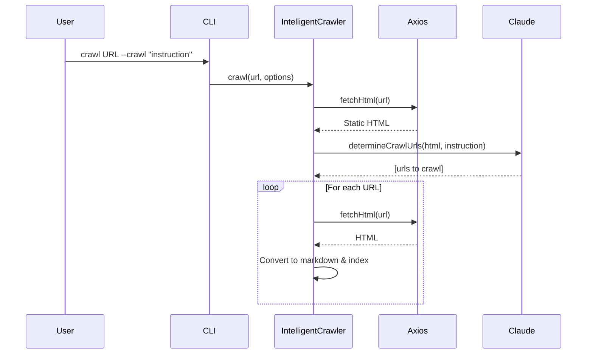
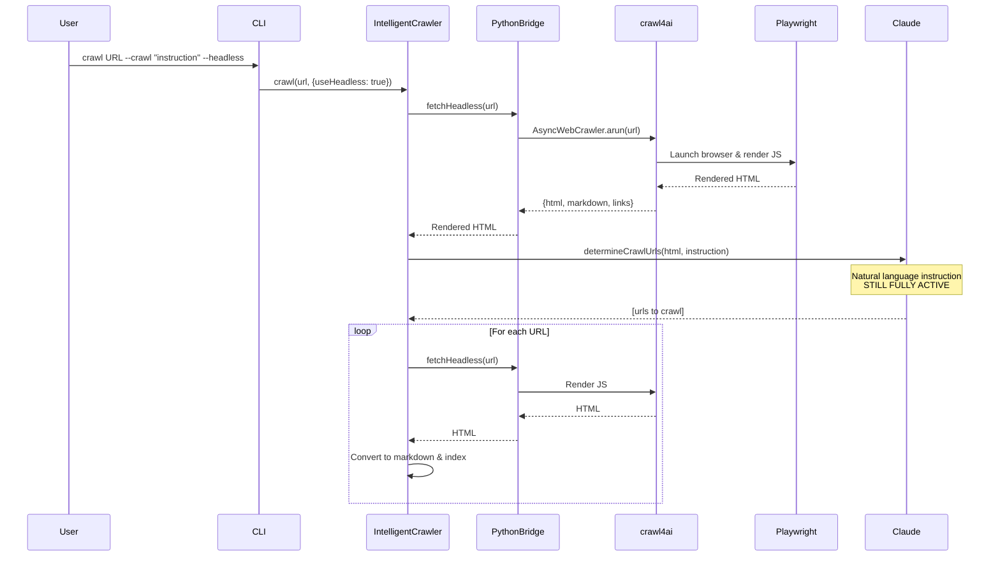

# 🧠 Bluera Knowledge

[](https://github.com/blueraai/bluera-knowledge/actions/workflows/ci.yml)


> 🚀 **Build a local knowledge base for your AI coding agent—dependency source code, crawled docs, and your own files, all instantly searchable.**

**Use it as:**
- 🔌 **Claude Code Plugin** — Slash commands + MCP tools + Skills for optimal Claude Code integration
- 📦 **npm Package** — Standalone CLI for any editor, CI/CD, or automation

Bluera Knowledge gives AI coding agents instant local access to authoritative context:

- **Dependency source code** — Clone and search the repos of dependencies you actually use
- **Documentation** — Crawl, index, and search any docs site
- **Your files** — Index and search local folders for project-specific knowledge

All searchable in milliseconds, no rate limits, fully offline.

## 📑 Table of Contents

<details>
<summary>Click to expand</summary>

- [Installation](#-installation)
- [Why Bluera Knowledge?](#-why-bluera-knowledge)
- [Token Efficiency](#-token-efficiency)
- [Quick Start](#-quick-start)
- [Features](#-features)
- [How It Works](#-how-it-works)
- [User Interface](#-user-interface)
- [Background Jobs](#-background-jobs)
- [Commands](#-commands)
- [Crawler Architecture](#-crawler-architecture)
- [Use Cases](#-use-cases)
- [Dependencies](#-dependencies)
- [Troubleshooting](#-troubleshooting)
- [MCP Integration](#-mcp-integration)
- [CLI Tool](#️-cli-tool)
- [Skills for Claude Code](#-skills-for-claude-code)
- [Data Storage](#-data-storage)
- [Development](#-development)
  - [Setup](#-setup)
  - [Claude Code Settings](#️-claude-code-settings-recommended)
  - [Commands / Scripts](#-commands)
  - [Releasing](#-releasing)
  - [Testing](#-testing-locally)
- [Technologies](#-technologies)
- [Contributing](#-contributing)
- [License](#-license)

</details>

---

## 📦 Installation

### As Claude Code Plugin

```bash
# Add the Bluera marketplace (one-time setup)
/plugin marketplace add blueraai/bluera-marketplace

# Install the plugin (or use /plugin to browse the UI)
/plugin install bluera-knowledge@bluera
```

> [!NOTE]
> **First launch may appear to hang** while the plugin installs Python dependencies (crawl4ai). This is normal—subsequent launches are instant.

### As npm Package

```bash
# Global install (CLI available everywhere)
npm install -g @bluera/bluera-knowledge

# Or project install
npm install --save-dev @bluera/bluera-knowledge
```

> [!TIP]
> Both installation methods provide the same core functionality. The plugin adds slash commands and Skills; the npm package provides a standalone CLI.

---

## ✨ Why Bluera Knowledge?

When you ask Claude Code "how do I handle errors in Express middleware?", it can:

1. **Guess from training data** — might be outdated or wrong
2. **Search the web** — slow, rate-limited, often returns blog posts instead of source
3. **Read your local knowledge base** — authoritative, complete, instant ✅

Bluera Knowledge enables option 3 by building a searchable knowledge base from **three types of sources**:

| Source Type | What It Does | Example |
|------------|--------------|---------|
| **📦 Dependency Source Code** | Clone & search library repos you actually use | Express, React, Lodash |
| **🌐 Documentation Sites** | Crawl & index any docs site | Next.js docs, FastAPI guides |
| **📁 Local Files** | Index project-specific content | Your docs, standards, API specs |

**The result:** Your AI agent has local, instant access to authoritative information with zero rate limits:

| Capability | Without | With Bluera Knowledge |
|------------|---------|----------------------|
| Response time | 2-5 seconds (web) | ~100ms (local) |
| Accuracy | Uncertain | Authoritative (source code + docs) |
| Completeness | Partial docs | Full implementation + tests + your content |
| Rate limits | Yes | None |

---

## 💰 Token Efficiency

Beyond speed and accuracy, Bluera Knowledge can **significantly reduce token consumption** for code-related queries—typically saving 60-75% compared to web search approaches.

### 📊 How It Works

**Without Bluera Knowledge:**
- Web searches return 5-10 results (~500-2,000 tokens each)
- Total per search: **3,000-10,000 tokens**
- Often need multiple searches to find the right answer
- Lower signal-to-noise ratio (blog posts mixed with actual docs)

**With Bluera Knowledge:**
- Semantic search returns top 10 relevant code chunks (~200-400 tokens each)
- Structured metadata (file paths, imports, purpose)
- Total per search: **1,500-3,000 tokens**
- Higher relevance due to vector search (fewer follow-up queries needed)

### 🎯 Real-World Examples

#### Example 1: Library Implementation Question

**Question:** "How does Express handle middleware errors?"

| Approach | Token Cost | Result |
|----------|-----------|--------|
| **Web Search** | ~8,000 tokens<br/>(3 searches: general query → refined query → source code) | Blog posts + Stack Overflow + eventual guess |
| **Bluera Knowledge** | ~2,000 tokens<br/>(1 semantic search) | Actual Express source code, authoritative |
| **Savings** | **75% fewer tokens** ✅ | Higher accuracy |

#### Example 2: Dependency Exploration

**Question:** "How does LanceDB's vector search work?"

| Approach | Token Cost | Result |
|----------|-----------|--------|
| **Web Search** | ~9,500 tokens<br/>(General docs → API docs → fetch specific page) | Documentation, might miss implementation details |
| **Bluera Knowledge** | ~1,500 tokens<br/>(Search returns source + tests + examples) | Source code from Python + Rust implementation |
| **Savings** | **84% fewer tokens** ✅ | Complete picture |

#### Example 3: Version-Specific Behavior

**Question:** "What changed in React 18's useEffect cleanup?"

| Approach | Token Cost | Result |
|----------|-----------|--------|
| **Training Data** | 0 tokens (but might be outdated) | Uncertain if accurate for React 18 |
| **Web Search** | ~5,000 tokens<br/>(Search changelog → blog posts → docs) | Mix of React 17 and 18 info |
| **Bluera Knowledge** | ~2,000 tokens<br/>(Search indexed React 18 source) | Exact React 18 implementation |
| **Savings** | **60% fewer tokens** ✅ | Version-accurate |

### ⚖️ When BK Uses More Tokens

Bluera Knowledge isn't always the most token-efficient choice:

| Scenario | Best Approach | Why |
|----------|---------------|-----|
| **Simple concept questions**<br/>("What is a JavaScript closure?") | Training data | Claude already knows this (0 tokens) |
| **Current events**<br/>("Latest Next.js 15 release notes") | Web search | BK only has what you've indexed |
| **General advice**<br/>("How to structure a React app?") | Training data | Opinion-based, not code-specific |

### 📈 Summary: Token Savings by Query Type

| Query Type | Typical Token Savings | When to Use BK |
|------------|----------------------|----------------|
| **Library internals** | 60-75% | ✅ Always |
| **Version-specific behavior** | 50-70% | ✅ Always |
| **"How does X work internally?"** | 70-85% | ✅ Always |
| **API usage examples** | 40-60% | ✅ Recommended |
| **General concepts** | -100% (uses more) | ❌ Skip BK |
| **Current events** | -100% (uses more) | ❌ Skip BK |

### 💡 Best Practice

Let Claude Code decide when to use Bluera Knowledge:
- For **library-specific, version-specific, or implementation questions** → BK saves tokens and increases accuracy
- For **general programming concepts** → Training data is more efficient
- For **current events** → Web search is necessary

The plugin's Skills teach Claude Code these patterns, so it automatically uses the most efficient approach for each question.

---

## 🚀 Quick Start

### Using Claude Code Plugin

- [ ] **📦 Add a library**: `/bluera-knowledge:add-repo https://github.com/lodash/lodash`
- [ ] **📁 Index your docs**: `/bluera-knowledge:add-folder ./docs --name=project-docs`
- [ ] **🔍 Test search**: `/bluera-knowledge:search "deep clone object"`
- [ ] **📋 View stores**: `/bluera-knowledge:stores`

> [!TIP]
> Not sure which libraries to index? Use `/bluera-knowledge:suggest` to analyze your project's dependencies.

### Using CLI (npm package)

```bash
# Add a library
bluera-knowledge store create lodash --type repo --source https://github.com/lodash/lodash

# Index your docs
bluera-knowledge store create project-docs --type file --source ./docs

# Test search
bluera-knowledge search "deep clone object"

# View stores
bluera-knowledge store list
```

---

## ✨ Features

### 🎯 Core Features

- **🔬 Smart Dependency Analysis** - Automatically scans your project to identify which libraries are most heavily used by counting import statements across all source files
- **📊 Usage-Based Suggestions** - Ranks dependencies by actual usage frequency, showing you the top 5 most-imported packages with import counts and file counts
- **🔍 Automatic Repository Discovery** - Queries package registries (NPM, PyPI, crates.io, Go modules) to automatically find GitHub repository URLs
- **📦 Git Repository Indexing** - Clones and indexes dependency source code for both semantic search and direct file access
- **📁 Local Folder Indexing** - Indexes any local content - documentation, standards, reference materials, or custom content
- **🌐 Web Crawling** - Crawl and index web pages using `crawl4ai` - convert documentation sites to searchable markdown

### 🔍 Search Modes

- **🧠 Vector Search** - AI-powered semantic search with relevance ranking
- **📂 File Access** - Direct Grep/Glob operations on cloned source files

### 🗺️ Code Graph Analysis

- **📊 Code Graph Analysis** - During indexing, builds a graph of code relationships (calls, imports, extends) to provide usage context in search results - shows how many callers/callees each function has
- **🌐 Multi-Language Support** - Full AST parsing for JavaScript, TypeScript, Python, Rust, and Go; indexes code in any language
- **🔌 MCP Integration** - Exposes all functionality as Model Context Protocol tools for AI coding agents

### 🌍 Language-Specific Features

While bluera-knowledge indexes and searches code in any language, certain advanced features are language-specific:

| Language | Code Graph | Call Analysis | Import Tracking | Method Tracking |
|----------|------------|---------------|-----------------|-----------------|
| **TypeScript/JavaScript** | ✅ Full Support | ✅ Functions & Methods | ✅ Full | ✅ Class Methods |
| **Python** | ✅ Full Support | ✅ Functions & Methods | ✅ Full | ✅ Class Methods |
| **Rust** | ✅ Full Support | ✅ Functions & Methods | ✅ Full | ✅ Struct/Trait Methods |
| **Go** | ✅ Full Support | ✅ Functions & Methods | ✅ Full | ✅ Struct/Interface Methods |
| **Other Languages** | ⚠️ Basic Support | ❌ | ❌ | ❌ |

> [!NOTE]
> Code graph features enhance search results by showing usage context (e.g., "this function is called by 15 other functions"), but all languages benefit from vector search and full-text search capabilities.

---

## 🎯 How It Works

The plugin provides AI agents with **four complementary search capabilities**:

### 🔍 1. Semantic Vector Search
**AI-powered search across all indexed content**

- Searches by meaning and intent, not just keywords
- Uses embeddings to find conceptually similar content
- Ideal for discovering patterns and related concepts

### 📝 2. Full-Text Search (FTS)
**Fast keyword and pattern matching**

- Traditional text search with exact matching
- Supports regex patterns and boolean operators
- Best for finding specific terms or identifiers

### ⚡ 3. Hybrid Mode (Recommended)
**Combines vector and FTS search**

- Merges results from both search modes with weighted ranking
- Balances semantic understanding with exact matching
- Provides best overall results for most queries

### 📂 4. Direct File Access
**Traditional file operations on cloned sources**

- Provides file paths to cloned repositories
- Enables Grep, Glob, and Read operations on source files
- Supports precise pattern matching and code navigation
- Full access to complete file trees

<details>
<summary>💡 <b>How Commands Work</b></summary>

When you use `/bluera-knowledge:` commands, here's what happens:

1. **You issue a command** - Type `/bluera-knowledge:stores` or similar in Claude Code
2. **Claude Code receives instructions** - The command provides step-by-step instructions for Claude Code
3. **Claude Code executes MCP tools** - Behind the scenes, Claude Code uses `mcp__bluera-knowledge__*` tools
4. **Results are formatted** - Claude Code formats and displays the output directly to you

**Example Flow:**
```
You: /bluera-knowledge:stores
  ↓
Command file instructs Claude Code to use list_stores tool
  ↓
MCP tool queries LanceDB for store metadata
  ↓
Claude Code formats results as a table
  ↓
You see: Beautiful table of all your knowledge stores
```

This architecture means commands provide a clean user interface while MCP tools handle the backend operations.
</details>

---

## 🎨 User Interface

### 👤 User Commands
**You manage knowledge stores through `/bluera-knowledge:` commands:**

- 🔬 Analyze your project to find important dependencies
- 📦 Add Git repositories (dependency source code)
- 📁 Add local folders (documentation, standards, etc.)
- 🌐 Crawl web pages and documentation
- 🔍 Search across all indexed content
- 🔄 Manage and re-index stores

### 🤖 MCP Tools
**AI agents access knowledge through Model Context Protocol:**

| Tool | Purpose |
|------|---------|
| `search` | 🔍 Semantic vector search across all stores |
| `get_store_info` | 📂 Get file paths for direct Grep/Glob access |
| `list_stores` | 📋 View available knowledge stores |
| `create_store` | ➕ Add new knowledge sources |
| `index_store` | 🔄 Re-index existing stores |
| `delete_store` | 🗑️ Delete a store and all associated data |
| `get_full_context` | 📖 Retrieve complete code context |
| `check_job_status` | ⏱️ Check background vector indexing job progress |
| `list_jobs` | 📊 List all background vector indexing jobs |
| `cancel_job` | ⛔ Cancel running operations |

---

## ⚙️ Background Jobs

> [!TIP]
> Long-running operations (git clone, indexing) run in the background, allowing you to continue working while they complete.

### 🔄 How It Works

When you add a repository or index content:

1. **⚡ Instant Response** - Operation starts immediately and returns a job ID
2. **🔄 Background Processing** - Indexing runs in a separate process
3. **📊 Progress Updates** - Check status anytime with `/bluera-knowledge:check-status`
4. **🔔 Auto-Notifications** - Active jobs appear automatically in context

### 📝 Example Workflow

```bash
# Add a large repository (returns immediately with job ID)
/bluera-knowledge:add-repo https://github.com/facebook/react

# Output:
# ✓ Created store: react (a1b2c3d4...)
# 🔄 Indexing started in background
#    Job ID: job_abc123def456
#
# Check status with: /bluera-knowledge:check-status job_abc123def456

# Check progress anytime
/bluera-knowledge:check-status job_abc123def456

# Output:
# Job Status: job_abc123def456
# Status:   running
# Progress: ███████████░░░░░░░░░ 45%
# Message:  Indexed 562/1,247 files

# View all active jobs
/bluera-knowledge:check-status

# Cancel if needed
/bluera-knowledge:cancel job_abc123def456
```

### 🚀 Performance

Background jobs include significant performance optimizations:

- **⚡ Parallel Embedding** - Processes 32 chunks simultaneously (~30x faster than sequential)
- **🔓 Non-Blocking** - Continue working while indexing completes
- **📊 Progress Tracking** - Real-time updates on files processed and progress percentage
- **🧹 Auto-Cleanup** - Completed jobs are cleaned up after 24 hours

---

## 📖 Quick Reference

| Command | Purpose | Arguments |
|---------|---------|-----------|
| 🔬 `/bluera-knowledge:suggest` | Analyze project dependencies | None |
| 📦 `/bluera-knowledge:add-repo` | Clone and index Git repository | `<url> [--name=<name>] [--branch=<branch>]` |
| 📁 `/bluera-knowledge:add-folder` | Index local folder | `<path> --name=<name>` |
| 🔍 `/bluera-knowledge:search` | Search knowledge stores | `"<query>" [--stores=<names>] [--limit=<N>]` |
| 📋 `/bluera-knowledge:stores` | List all stores | None |
| 🔄 `/bluera-knowledge:index` | Re-index a store | `<store-name-or-id>` |
| 🗑️ `/bluera-knowledge:remove-store` | Delete a store and all data | `<store-name-or-id>` |
| 🌐 `/bluera-knowledge:crawl` | Crawl web pages | `<url> <store-name> [--crawl "<instruction>"]` |

---

## 💻 Commands

### 🔬 `/bluera-knowledge:suggest`

**Analyze your project to suggest libraries worth indexing as knowledge stores**

```bash
/bluera-knowledge:suggest
```

Scans source files, counts import statements, and suggests the top 5 most-used dependencies with their repository URLs.

**Supported languages:**
| Language | Manifest File | Registry |
|----------|---------------|----------|
| JavaScript/TypeScript | `package.json` | NPM |
| Python | `requirements.txt`, `pyproject.toml` | PyPI |
| Rust | `Cargo.toml` | crates.io |
| Go | `go.mod` | Go modules |

<details>
<summary><b>📊 Expected Output</b></summary>

```
## Dependency Analysis

Scanned 342 source files and found 24 dependencies.

### Top Dependencies by Usage

1. **react** (156 imports across 87 files)
   Repository: https://github.com/facebook/react

   Add with:
   /bluera-knowledge:add-repo https://github.com/facebook/react --name=react

2. **vitest** (40 imports across 40 files)
   Repository: https://github.com/vitest-dev/vitest

   Add with:
   /bluera-knowledge:add-repo https://github.com/vitest-dev/vitest --name=vitest

3. **lodash** (28 imports across 15 files)
   Repository: https://github.com/lodash/lodash

   Add with:
   /bluera-knowledge:add-repo https://github.com/lodash/lodash --name=lodash

---

Already indexed: typescript, express
```
</details>

---

### 📦 `/bluera-knowledge:add-repo`

**Clone and index a Git repository**

```bash
/bluera-knowledge:add-repo <url> [--name=<name>] [--branch=<branch>]
```

**Examples:**
```bash
/bluera-knowledge:add-repo https://github.com/lodash/lodash
/bluera-knowledge:add-repo https://github.com/facebook/react --branch=main --name=react
```

<details>
<summary><b>✅ Expected Output</b></summary>

```
✓ Cloning https://github.com/facebook/react...
✓ Created store: react (a1b2c3d4...)
  Location: ~/.local/share/bluera-knowledge/stores/a1b2c3d4.../

✓ Indexing...
✓ Indexed 1,247 files

Store is ready for searching!
```
</details>

---

### 📁 `/bluera-knowledge:add-folder`

**Index a local folder**

```bash
/bluera-knowledge:add-folder <path> --name=<name>
```

**📚 Use cases:**
- 📖 Project documentation
- 📏 Coding standards
- 🎨 Design documents
- 🔌 API specifications
- 📚 Reference materials
- 📄 Any other content

**Examples:**
```bash
/bluera-knowledge:add-folder ./docs --name=project-docs
/bluera-knowledge:add-folder ./architecture --name=design-docs
```

<details>
<summary><b>✅ Expected Output</b></summary>

```
✓ Adding folder: ~/my-project/docs...
✓ Created store: project-docs (e5f6g7h8...)
  Location: ~/.local/share/bluera-knowledge/stores/e5f6g7h8.../

✓ Indexing...
✓ Indexed 342 files

Store is ready for searching!
```
</details>

---

### 🔍 `/bluera-knowledge:search`

**Search across indexed knowledge stores**

```bash
/bluera-knowledge:search "<query>" [--stores=<names>] [--limit=<number>]
```

**Examples:**
```bash
# Search all stores
/bluera-knowledge:search "how to invalidate queries"

# Search specific store
/bluera-knowledge:search "useState implementation" --stores=react

# Search multiple stores (comma-separated)
/bluera-knowledge:search "deep clone" --stores=react,lodash

# Limit results
/bluera-knowledge:search "testing patterns" --limit=5
```

<details>
<summary><b>📊 Expected Output</b></summary>

```
## Search Results: "button component" (hybrid search)

**1. [Score: 0.95] [Vector+FTS]**
Store: react
File: 📄 src/components/Button.tsx
Purpose: → Reusable button component with variants
Top Terms: 🔑 (in this chunk): button, variant, size, color, onClick
Imports: 📦 (in this chunk): React, clsx

**2. [Score: 0.87] [Vector]**
Store: react
File: 📄 src/hooks/useButton.ts
Purpose: → Custom hook for button state management
Top Terms: 🔑 (in this chunk): hook, state, pressed, disabled
Imports: 📦 (in this chunk): useState, useCallback

**3. [Score: 0.81] [Vector+FTS]**
Store: react
File: 📄 src/components/IconButton.tsx
Purpose: → Button component with icon support
Top Terms: 🔑 (in this chunk): icon, button, aria-label, accessible

---
**Found 3 results in 45ms**

💡 **Next Steps:**
- Read file: `Read src/components/Button.tsx`
- Get full code: `mcp__bluera-knowledge__get_full_context("result-id")`
- Refine search: Use keywords above
```
</details>

---

### 📋 `/bluera-knowledge:stores`

**List all indexed knowledge stores**

```bash
/bluera-knowledge:stores
```

Shows store name, type, ID, and source location in a clean table format.

<details>
<summary><b>📊 Expected Output</b></summary>

```
| Name | Type | ID | Source |
|------|------|----|--------------------|
| react | repo | 459747c7 | https://github.com/facebook/react |
| crawl4ai | repo | b5a72a94 | https://github.com/unclecode/crawl4ai.git |
| project-docs | file | 70f6309b | ~/repos/my-project/docs |
| claude-docs | web | 9cc62018 | https://code.claude.com/docs |

**Total**: 4 stores
```
</details>

---

### 🔄 `/bluera-knowledge:index`

**Re-index an existing store to update the search index**

```bash
/bluera-knowledge:index <store-name-or-id>
```

**🔄 When to re-index:**
- The source repository has been updated (for repo stores)
- Files have been added or modified (for file stores)
- Search results seem out of date

**Example:**
```bash
/bluera-knowledge:index react
```

<details>
<summary><b>✅ Expected Output</b></summary>

```
✓ Indexing store: react...
✓ Indexed 1,247 documents in 3,421ms

Store search index is up to date!
```
</details>

---

### 🗑️ `/bluera-knowledge:remove-store`

**Delete a knowledge store and all associated data**

```bash
/bluera-knowledge:remove-store <store-name-or-id>
```

**🗑️ What gets deleted:**
- Store registry entry
- LanceDB search index (vector embeddings)
- Cloned repository files (for repo stores created from URLs)

**Example:**
```bash
/bluera-knowledge:remove-store react
```

<details>
<summary><b>✅ Expected Output</b></summary>

```
Store "react" deleted successfully.

Removed:
- Store registry entry
- LanceDB search index
- Cloned repository files
```
</details>

---

### 🌐 `/bluera-knowledge:crawl`

**Crawl web pages with natural language control**

```bash
/bluera-knowledge:crawl <url> <store-name> [options]
```

**Options:**
- `--crawl "<instruction>"` - Natural language instruction for which pages to crawl
- `--extract "<instruction>"` - Natural language instruction for what content to extract
- `--simple` - Use simple BFS mode instead of intelligent crawling
- `--max-pages <n>` - Maximum pages to crawl (default: 50)
- `--headless` - Use headless browser for JavaScript-rendered sites (Next.js, React, Vue)

**⚙️ Requirements:**
- 🐍 Python 3 with `crawl4ai` package installed
- 📦 A web store must be created first

**Examples:**
```bash
# Basic crawl
/bluera-knowledge:crawl https://docs.example.com/guide my-docs

# Intelligent crawl with custom strategy
/bluera-knowledge:crawl https://react.dev react-docs --crawl "all API reference pages"

# Extract specific content from pages
/bluera-knowledge:crawl https://example.com/pricing pricing --extract "pricing tiers and features"

# Combine crawl strategy + extraction
/bluera-knowledge:crawl https://docs.python.org python-docs \
  --crawl "standard library modules" \
  --extract "function signatures and examples"

# JavaScript-rendered sites (Next.js, React, etc.)
/bluera-knowledge:crawl https://nextjs.org/docs nextjs-docs --headless --max-pages 30

# Simple BFS mode (no AI guidance)
/bluera-knowledge:crawl https://example.com/docs docs --simple --max-pages 100
```

The crawler converts pages to markdown and indexes them for semantic search.

---

## 🕷️ Crawler Architecture

The crawler supports two modes: **standard mode** for static sites (fast) and **headless mode** for JavaScript-rendered sites (powerful).

### ⚡ Standard Mode (Static Sites)

For static HTML sites, the crawler uses axios for fast HTTP requests:



### 🎭 Headless Mode (JavaScript-Rendered Sites)

For JavaScript-rendered sites (Next.js, React, Vue), use `--headless` to render content with Playwright:



### 🔑 Key Points

- **🧠 Intelligent crawling preserved** - Claude Code CLI analyzes pages and selects URLs based on natural language instructions in both modes
- **🎭 crawl4ai role** - ONLY renders JavaScript to get HTML - doesn't replace Claude's intelligent URL selection
- **⚡ Hybrid approach** - Fast axios for static sites, Playwright for JS-rendered sites
- **🔄 Automatic fallback** - If headless fetch fails, automatically falls back to axios

### 🤖 Intelligent Mode vs Simple Mode

The crawler operates in two modes depending on Claude Code CLI availability:

| Mode | Requires Claude CLI | Behavior |
|------|---------------------|----------|
| **Intelligent** | ✅ Yes | Claude analyzes pages and selects URLs based on natural language instructions |
| **Simple (BFS)** | ❌ No | Breadth-first crawl up to max depth (2 levels) |

**Automatic detection:**
- When Claude Code CLI is available: Full intelligent mode with `--crawl` and `--extract` instructions
- When Claude Code CLI is unavailable: Automatically uses simple BFS mode
- Clear messaging: "Claude CLI not found, using simple crawl mode"

> [!NOTE]
> Install Claude Code to unlock `--crawl` (AI-guided URL selection) and `--extract` (AI content extraction). Without it, web crawling still works but uses simple BFS mode.

---

## 🔧 Troubleshooting

<details>
<summary><b>❌ Command not found or not recognized</b></summary>

Ensure the plugin is installed and enabled:

```bash
/plugin list
/plugin enable bluera-knowledge
```

If the plugin isn't listed, install it:

```bash
/plugin marketplace add blueraai/bluera-marketplace
/plugin install bluera-knowledge@bluera
```
</details>

<details>
<summary><b>🌐 Web crawling fails</b></summary>

Check Python dependencies:

```bash
python3 --version  # Should be 3.8+
pip install crawl4ai
```

The plugin attempts to auto-install `crawl4ai` on first use, but manual installation may be needed in some environments.
</details>

<details>
<summary><b>🔍 Search returns no results</b></summary>

1. Verify store exists: `/bluera-knowledge:stores`
2. Check store is indexed: `/bluera-knowledge:index <store-name>`
3. Try broader search terms
4. Verify you're searching the correct store with `--stores=<name>`
</details>

<details>
<summary><b>❓ "Store not found" error</b></summary>

List all stores to see available names and IDs:

```bash
/bluera-knowledge:stores
```

Use the exact store name or ID shown in the table.
</details>

<details>
<summary><b>⏱️ Indexing is slow or fails</b></summary>

Large repositories (10,000+ files) take longer to index. If indexing fails:

1. Check available disk space
2. Ensure the source repository/folder is accessible
3. For repo stores, verify git is installed: `git --version`
4. Check for network connectivity (for repo stores)
</details>

<details>
<summary><b>🤖 "Claude CLI not found" during crawl</b></summary>

This means intelligent crawling is unavailable. The crawler will automatically use simple BFS mode instead.

To enable intelligent crawling with `--crawl` and `--extract`:
1. Install Claude Code: https://claude.com/code
2. Ensure `claude` command is in PATH: `which claude`

Simple mode still crawls effectively—it just doesn't use AI to select which pages to crawl or extract specific content.
</details>

---

## 🎯 Use Cases

### 📦 Dependency Source Code

Provide AI agents with canonical dependency implementation details:

```bash
/bluera-knowledge:suggest
/bluera-knowledge:add-repo https://github.com/expressjs/express

# AI agents can now:
# - Semantic search: "middleware error handling"
# - Direct access: Grep/Glob through the cloned express repo
```

### 📚 Project Documentation

Make project-specific documentation available:

```bash
/bluera-knowledge:add-folder ./docs --name=project-docs
/bluera-knowledge:add-folder ./architecture --name=architecture

# AI agents can search across all documentation or access specific files
```

### 📏 Coding Standards

Provide definitive coding standards and best practices:

```bash
/bluera-knowledge:add-folder ./company-standards --name=standards
/bluera-knowledge:add-folder ./api-specs --name=api-docs

# AI agents reference actual company standards, not generic advice
```

### 🔀 Mixed Sources

Combine canonical library code with project-specific patterns:

```bash
/bluera-knowledge:add-repo https://github.com/facebook/react --name=react
/bluera-knowledge:add-folder ./docs/react-patterns --name=react-patterns

# Search across both dependency source and team patterns
```

---

## 💭 What Claude Code Says About Bluera Knowledge

> ### *As an AI coding assistant, here's what I've discovered using this plugin*
>
> ---
>
> #### ⚡ The Immediate Impact
>
> **The difference is immediate.** When a user asks "how does React's useEffect cleanup work?", I can search the actual React source code indexed locally instead of relying on my training data or making web requests. The results include the real implementation, related functions, and usage patterns—all in ~100ms.
>
> **Code graph analysis changes the game.** The plugin doesn't just index files—it builds a relationship graph showing which functions call what, import dependencies, and class hierarchies. When I search for a function, I see how many places call it and what it calls. This context makes my suggestions dramatically more accurate.
>
> ---
>
> #### 🔀 Multi-Modal Search Power
>
> I can combine three search approaches in a single workflow:
>
> | Mode | Use Case | Example |
> |------|----------|---------|
> | 🧠 **Semantic** | Conceptual queries | "authentication flow with JWT validation" |
> | 📂 **Direct Access** | Pattern matching | Grep for specific identifiers in cloned repos |
> | 📝 **Full-Text** | Exact matches | Find precise function names or imports |
>
> This flexibility means I can start broad (semantic) and narrow down (exact file access) seamlessly.
>
> ---
>
> #### 🕷️ Intelligent Crawling
>
> **The `--crawl` instruction isn't marketing**—it actually uses Claude Code CLI to analyze each page and intelligently select which links to follow. I can tell it "crawl all API reference pages but skip blog posts" and it understands the intent.
>
> For JavaScript-rendered sites (Next.js, React docs), the `--headless` mode renders pages with Playwright while I still control the crawl strategy with natural language.
>
> ---
>
> #### ✨ What Makes It Valuable
>
> | Benefit | Impact |
> |---------|--------|
> | ✅ **No guessing** | I read actual source code, not blog interpretations |
> | 🔌 **Offline first** | Works without internet, zero rate limits |
> | 🎯 **Project-specific** | Index your team's standards, not generic advice |
> | ⚡ **Speed** | Sub-100ms searches vs 2-5 second web lookups |
> | 📚 **Completeness** | Tests, implementation details, edge cases—all indexed |
>
> ---
>
> #### 🌟 When It Shines Most
>
> 1. **Deep library questions** - "how does this internal method handle edge cases?"
> 2. **Version-specific answers** - your indexed version is what you're actually using
> 3. **Private codebases** - your docs, your standards, your patterns
> 4. **Complex workflows** - combining semantic search + direct file access + code graph
>
> ---
>
> The plugin essentially gives me a **photographic memory** of your dependencies and documentation.
>
> Instead of *"I think based on training data"*, I can say *"I searched the indexed React v18.2.0 source and found this in `ReactFiberWorkLoop.js:1247`"*.
>
> **That's the difference between helpful and authoritative.**

---

## 🔧 Dependencies

The plugin automatically checks for and attempts to install Python dependencies on first use:

**Required:**
- **🐍 Python 3.8+** - Required for web crawling functionality
- **🕷️ crawl4ai** - Required for web crawling (auto-installed via SessionStart hook, includes playwright)
- **🎭 Playwright browser binaries** - Required for `--headless` mode on JavaScript-rendered sites (**manual install required**)

**What the SessionStart hook installs:**
- ✅ crawl4ai Python package (includes playwright as dependency)
- ❌ Playwright browser binaries (you must run `playwright install` manually)

If auto-installation of crawl4ai fails, install manually:

```bash
pip install crawl4ai
playwright install  # Required for --headless mode (Next.js, React, Vue sites)
```

> [!WARNING]
> The plugin will work without crawl4ai/playwright, but web crawling features (`/bluera-knowledge:crawl`) will be unavailable. For JavaScript-rendered sites (Next.js, React, Vue), use the `--headless` flag which requires playwright browser binaries.

**Update Plugin:**
```bash
/plugin update bluera-knowledge
```

---

## 🔌 MCP Integration

The plugin includes a Model Context Protocol server that exposes search tools. This is configured in `mcp.plugin.json`:

> [!IMPORTANT]
> **Commands vs MCP Tools**: You interact with the plugin using `/bluera-knowledge:` slash commands. Behind the scenes, these commands instruct Claude Code to use MCP tools (`mcp__bluera-knowledge__*`) which handle the actual operations. Commands provide the user interface, while MCP tools are the backend that AI agents use to access your knowledge stores.

```json
{
  "mcpServers": {
    "bluera-knowledge": {
      "command": "node",
      "args": ["${CLAUDE_PLUGIN_ROOT}/dist/mcp/server.js"],
      "env": {
        "DATA_DIR": ".bluera/bluera-knowledge/data",
        "CONFIG_PATH": ".bluera/bluera-knowledge/config.json"
      }
    }
  }
}
```

### 🛠️ Available MCP Tools

#### `search`
🔍 Semantic vector search across all indexed stores or a specific subset. Returns structured code units with relevance ranking.

**Parameters:**
- `query` - Search query (natural language, patterns, or type signatures)
- `intent` - Search intent: find-pattern, find-implementation, find-usage, find-definition, find-documentation
- `detail` - Context level: minimal, contextual, or full
- `limit` - Maximum results (default: 10)
- `stores` - Array of specific store IDs to search (optional, searches all stores if not specified)

#### `get_store_info`
📂 Get detailed information about a store including its file path for direct Grep/Glob access.

**Returns:**
- Store metadata
- File path to cloned repository or indexed folder
- Enables direct file operations on source

#### `list_stores`
📋 List all indexed knowledge stores.

**Parameters:**
- `type` - Filter by type: file, repo, or web (optional)

#### `create_store`
➕ Create a new knowledge store from Git URL or local path.

#### `index_store`
🔄 Index or re-index a knowledge store to make it searchable.

#### `get_full_context`
📖 Retrieve complete code and context for a specific search result.

---

## 🖥️ CLI Tool

While Bluera Knowledge works seamlessly as a Claude Code plugin, it's also available as a standalone CLI tool for use outside Claude Code.

> [!NOTE]
> When using CLI without Claude Code installed, web crawling uses simple BFS mode. Install Claude Code to unlock `--crawl` (AI-guided URL selection) and `--extract` (AI content extraction) instructions.

### Installation

Install globally via npm:

```bash
npm install -g @bluera/bluera-knowledge
```

Or use in a project:

```bash
npm install --save-dev @bluera/bluera-knowledge
```

### Usage

#### Create a Store

```bash
# Add a Git repository
bluera-knowledge store create react --type repo --source https://github.com/facebook/react

# Add a local folder
bluera-knowledge store create my-docs --type file --source ./docs

# Add a web crawl
bluera-knowledge store create fastapi-docs --type web --source https://fastapi.tiangolo.com
```

#### Index a Store

```bash
bluera-knowledge index react
```

#### Search

```bash
# Search across all stores
bluera-knowledge search "how does useEffect work"

# Search specific stores
bluera-knowledge search "routing" --stores react,vue

# Get more results with full content
bluera-knowledge search "middleware" --limit 20 --include-content
```

#### List Stores

```bash
bluera-knowledge store list
bluera-knowledge store list --type repo  # Filter by type
```

#### Store Info

```bash
bluera-knowledge store info react
```

#### Delete a Store

```bash
bluera-knowledge store delete old-store
```

### Global Options

```bash
--config <path>      # Custom config file
--data-dir <path>    # Custom data directory
--format <format>    # Output format: json | table | plain
--quiet              # Suppress non-essential output
--verbose            # Enable verbose logging
```

### When to Use CLI vs Plugin

**Use CLI when:**
- Using an editor other than Claude Code (VSCode, Cursor, etc.)
- Integrating into CI/CD pipelines
- Scripting or automation
- Pre-indexing dependencies for teams

**Use Plugin when:**
- Working within Claude Code
- Want slash commands (`/bluera-knowledge:search`)
- Need Claude to automatically query your knowledge base
- Want Skills to guide optimal usage

Both interfaces use the same underlying services, so you can switch between them seamlessly.

---

## 🎓 Skills for Claude Code

> [!NOTE]
> Skills are a Claude Code-specific feature. They're automatically loaded when using the plugin but aren't available when using the npm package directly.

Bluera Knowledge includes built-in Skills that teach Claude Code how to use the plugin effectively. Skills provide procedural knowledge that complements the MCP tools.

### 📚 Available Skills

#### `knowledge-search`
Teaches the two approaches for accessing dependency sources:
- Vector search via MCP/slash commands for discovery
- Direct Grep/Read access to cloned repos for precision

**When to use:** Understanding how to query indexed libraries

#### `when-to-query`
Decision guide for when to query BK stores vs using Grep/Read on current project.

**When to use:** Deciding whether a question is about libraries or your project code

#### `advanced-workflows`
Multi-tool orchestration patterns for complex operations.

**When to use:** Progressive library exploration, adding libraries, handling large results

#### `search-optimization`
Guide on search parameters and progressive detail strategies.

**When to use:** Optimizing search results, choosing the right intent and detail level

#### `store-lifecycle`
Best practices for creating, indexing, and managing stores.

**When to use:** Adding new stores, understanding when to use repo/folder/crawl

### 🔄 MCP + Skills Working Together

Skills teach **how** to use the MCP tools effectively:
- MCP provides the **capabilities** (search, create_store, index_store, etc.)
- Skills provide **procedural knowledge** (when to use which tool, best practices, workflows)

This hybrid approach reduces unnecessary tool calls and context usage while maintaining universal MCP compatibility.

**Example:**
- MCP tool: `search(query, intent, detail, limit, stores)`
- Skill teaches: Which `intent` for your question type, when to use `detail='minimal'` vs `'full'`, how to narrow with `stores`

Result: Fewer tool calls, more accurate results, less context consumed.

---

## 💾 Data Storage

Knowledge stores are stored in your project root:

```
<project-root>/.bluera/bluera-knowledge/
├── data/
│   ├── repos/<store-id>/       # Cloned Git repositories
│   ├── documents_*.lance/      # Vector indices (Lance DB)
│   └── stores.json             # Store registry
└── config.json                 # Configuration
```

> [!CAUTION]
> **Important**: Add `.bluera/` to your `.gitignore` to avoid committing large repositories and vector indices to version control.

---

## 🛠️ Development

### 🚀 Setup

```bash
git clone https://github.com/blueraai/bluera-knowledge.git
cd bluera-knowledge
bun install
bun run build
bun test
```

> **Note:** This project uses [Bun](https://bun.sh) for development. Install it via `curl -fsSL https://bun.sh/install | bash`

### ⚙️ Claude Code Settings (Recommended)

For the best development experience with Claude Code, copy the example settings file:

```bash
cp .claude/settings.local.json.example .claude/settings.local.json
```

**This provides:**
- ✅ **Smart validation** - Automatically runs lint/typecheck after editing code (file-type aware)
- ✅ **No permission prompts** - Pre-approves common commands (lint, typecheck, precommit)
- ✅ **Desktop notifications** - macOS notifications when Claude needs your input
- ✅ **Plugin auto-enabled** - Automatically enables the bluera-knowledge plugin
- ✅ **Faster workflow** - Catch issues immediately without manual validation

The validation is intelligent - it only runs checks for TypeScript/JavaScript files, skipping docs/config to save time.

> **Note:** The `.claude/settings.local.json` file is gitignored (local to your machine). The example file is checked in for reference.

### 🔌 MCP Server

**`mcp.plugin.json`** (Plugin distribution)
- Located at plugin root, referenced from `plugin.json`
- Uses `${CLAUDE_PLUGIN_ROOT}` and points to compiled `dist/mcp/server.js`
- Only loaded when directory is loaded as a plugin (no project/plugin conflict)
- Committed to git and distributed with the plugin

**For local development/dogfooding:**

To enable live development without rebuilding, add a user-level MCP server config to `~/.claude.json`:

```json
{
  "mcpServers": {
    "bluera-knowledge-dev": {
      "command": "npx",
      "args": ["tsx", "/Users/yourname/repos/bluera-knowledge/src/mcp/server.ts"],
      "env": {
        "PWD": "${PWD}",
        "DATA_DIR": "${PWD}/.bluera/bluera-knowledge/data",
        "CONFIG_PATH": "${PWD}/.bluera/bluera-knowledge/config.json"
      }
    }
  }
}
```

Replace the path with your actual repo location. This creates a separate `bluera-knowledge-dev` MCP server that:
- Runs the source TypeScript directly via `tsx`
- Updates immediately when you modify MCP server code
- Doesn't interfere with the production plugin version

### 📜 Commands

| Command | Description | When to Use |
|---------|-------------|-------------|
| `bun run build` | 🏗️ Compile TypeScript to dist/ | Before testing CLI, after code changes |
| `bun run dev` | 👀 Watch mode compilation | During active development |
| `bun start` | ▶️ Run the CLI | Execute CLI commands directly |
| `bun test` | 🧪 Run tests in watch mode | During TDD/active development |
| `bun run test:run` | ✅ Run tests once | Quick verification |
| `bun run test:coverage` | 📊 Run tests with coverage | Before committing, CI checks |
| `bun run lint` | 🔍 Run ESLint | Check code style issues |
| `bun run typecheck` | 🔒 Run TypeScript type checking | Verify type safety |
| `bun run precommit` | ✨ Smart validation (file-type aware) | Runs only relevant checks based on changed files |
| `bun run prepush` | 📊 Smart coverage (skips for docs/config) | Runs coverage only when src/tests changed |
| `bun run lint:quiet` | 🔇 ESLint (minimal output) | Used by git hooks |
| `bun run typecheck:quiet` | 🔇 Type check (minimal output) | Used by git hooks |
| `bun run test:changed:quiet` | 🔇 Test changed files (minimal output) | Used by git hooks |
| `bun run test:coverage:quiet` | 🔇 Coverage (minimal output) | Used by git hooks |
| `bun run build:quiet` | 🔇 Build (minimal output) | Used by git hooks |

### 🔄 Automatic Build & Dist Commit

The `dist/` directory **must be committed** because Claude Code plugins are installed by copying files—there's no build step during installation.

**Good news: This is fully automatic!**

1. **On every commit**, the pre-commit hook intelligently validates based on file types
2. **If source/config changed**, it runs build and automatically stages `dist/` via `git add dist/`
3. **You never need to manually build or stage dist** — just commit your source changes

**For live rebuilding during development:**

```bash
bun run dev  # Watches for changes and rebuilds instantly
```

This is useful when testing CLI commands locally, but not required for committing — the hook handles everything.

| `bun run version:patch` | 🔢 Bump patch version (0.0.x) + generate CHANGELOG | Bug fixes, minor updates |
| `bun run version:minor` | 🔢 Bump minor version (0.x.0) + generate CHANGELOG | New features, backwards compatible |
| `bun run version:major` | 🔢 Bump major version (x.0.0) + generate CHANGELOG | Breaking changes |

### 🚀 Releasing

```bash
# Bump version, commit, tag, and push (triggers GitHub Actions release)
bun run release:patch   # Bug fixes (0.0.x)
bun run release:minor   # New features (0.x.0)
bun run release:major   # Breaking changes (x.0.0)
```

**Workflow (Fully Automated):**

1. Make changes and commit
2. Bump version: `bun run version:patch` (updates package.json, plugin.json, README, CHANGELOG)
3. Commit version bump: `git commit -am "chore: bump version to X.Y.Z"`
4. Push to main: `git push`
5. **GitHub Actions automatically:**
   - ✅ Runs CI (lint, typecheck, tests, build)
   - ✅ Creates release tag when CI passes
   - ✅ Creates GitHub release
   - ✅ Updates marketplace

> 💡 **That's it!** No manual tagging needed. Just push to `main` and the release happens automatically when CI passes.

### 🧪 Testing Locally

**Option 1: Development MCP Server (Recommended)**

Use the local development MCP server (see "MCP Server" section above) which runs your source code directly via `tsx`:

1. Set up dev MCP server in `~/.claude.json` (see MCP Server section)
2. Test your changes - MCP server updates automatically as you edit code

**Option 2: Test Plugin from Working Directory**

Load the plugin directly from your development directory:

```bash
cd /path/to/bluera-knowledge
claude --plugin-dir .
```

The MCP config in `mcp.plugin.json` is only loaded when the directory is loaded as a plugin (via `--plugin-dir` or marketplace install), so there's no conflict with project-level MCP config.

**Option 3: CLI Tool Testing**

```bash
# Build and link
cd /path/to/bluera-knowledge
bun run build
bun link

# Now 'bluera-knowledge' command is available globally
cd ~/your-project
bluera-knowledge search "test query" my-store
```

**For testing as an installed plugin:**
This requires publishing a new version to the marketplace.

### 📂 Project Structure

```
.claude-plugin/
└── plugin.json          # Plugin metadata (references mcp.plugin.json)

mcp.plugin.json          # MCP server configuration (plugin-scoped)
commands/                # Slash commands (auto-discovered)
skills/                  # Agent Skills (auto-discovered)
├── knowledge-search/    # How to access dependency sources
│   └── SKILL.md
├── when-to-query/       # When to query BK vs project files
│   └── SKILL.md
├── advanced-workflows/  # Multi-tool orchestration patterns
│   └── SKILL.md
├── search-optimization/ # Search parameter optimization
│   └── SKILL.md
└── store-lifecycle/     # Store management best practices
    └── SKILL.md
dist/                    # Built MCP server (committed for distribution)

src/
├── analysis/            # Dependency analysis & URL resolution
├── crawl/               # Web crawling with Python bridge
├── services/            # Index, store, and search services
├── mcp/                 # MCP server source
└── cli/                 # CLI entry point

tests/
├── integration/         # Integration tests
└── fixtures/            # Test infrastructure
```

---

## 🔬 Technologies

- **🔌 Claude Code Plugin System** with MCP server
- **✅ Runtime Validation** - [Zod](https://github.com/colinhacks/zod) schemas for Python-TypeScript boundary
- **🌳 AST Parsing** - [@babel/parser](https://github.com/babel/babel) for JS/TS, Python AST module, [tree-sitter](https://github.com/tree-sitter/tree-sitter) for Rust and Go
- **🗺️ Code Graph** - Static analysis of function calls, imports, and class relationships
- **🧠 Semantic Search** - AI-powered vector embeddings with [LanceDB](https://github.com/lancedb/lancedb)
- **📦 Git Operations** - Native git clone
- **💻 CLI** - [Commander.js](https://github.com/tj/commander.js)
- **🕷️ Web Crawling** - [crawl4ai](https://github.com/unclecode/crawl4ai) with [Playwright](https://github.com/microsoft/playwright) (headless browser)

---

## 🤝 Contributing

Contributions welcome! Please:

1. 🍴 Fork the repository
2. 🌿 Create a feature branch
3. ✅ Add tests
4. 📬 Submit a pull request

---

## 📄 License

MIT - See [LICENSE](./LICENSE) for details.

## 🙏 Acknowledgments

This project includes software developed by third parties. See [NOTICE](./NOTICE) for full attribution.

Key dependencies:
- **[Crawl4AI](https://github.com/unclecode/crawl4ai)** - Web crawling (Apache-2.0). *This product includes software developed by UncleCode ([@unclecode](https://x.com/unclecode)) as part of the Crawl4AI project.*
- **[LanceDB](https://github.com/lancedb/lancedb)** - Vector database (Apache-2.0)
- **[Hugging Face Transformers](https://github.com/huggingface/transformers.js)** - Embeddings (Apache-2.0)
- **[Playwright](https://github.com/microsoft/playwright)** - Browser automation (Apache-2.0)

---

## 💬 Support

- **🐛 Issues**: [GitHub Issues](https://github.com/blueraai/bluera-knowledge/issues)
- **📚 Documentation**: [Claude Code Plugins](https://code.claude.com/docs/en/plugins)
- **📝 Changelog**: [CHANGELOG.md](./CHANGELOG.md)
