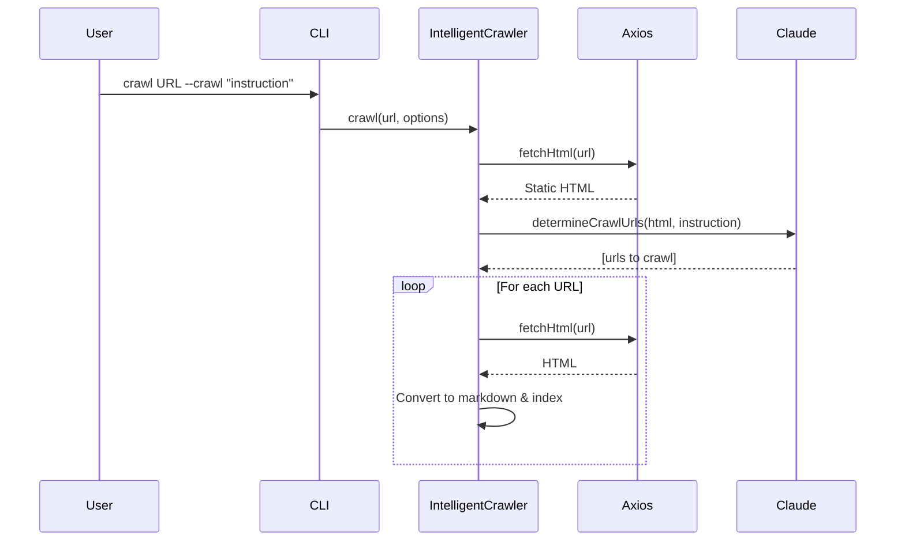
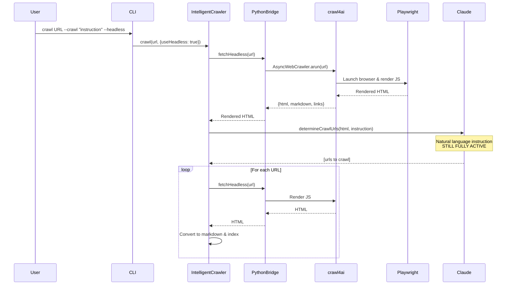

# 🧠 Bluera Knowledge

[](https://github.com/chris-bluera/bluera-knowledge/actions/workflows/ci.yml)


> 🚀 **A Claude Code plugin for providing canonical, definitive source information to AI coding agents.**

Give your AI coding assistant **instant access** to **authoritative library source code**, **documentation**, and **reference materials**—all searchable locally with **semantic understanding**.

---

## ✨ Why Bluera Knowledge?

Stop relying on outdated or incomplete information. Instead of:

- ❌ **Outdated training data** - Claude's knowledge cutoff may be months or years old
- ❌ **Web search** - Slow, rate-limited, and incomplete
- ❌ **Web fetch** - Slow, rate-limited, often blocked or paywalled

Get instant, authoritative answers with:

- ✅ **Instant local access** - All content indexed and ready
- ✅ **Complete source code** - Full repository clones, not just documentation
- ✅ **Web crawling** - Crawl and index web documentation automatically
- ✅ **Fast vector search** - Semantic search with relevance ranking
- ✅ **Direct file access** - Grep/Glob operations on complete source trees

---

## 🎯 How It Works

The plugin provides AI agents with **four complementary search capabilities**:

### 🔍 1. Semantic Vector Search
**AI-powered search across all indexed content**

- Searches by meaning and intent, not just keywords
- Uses embeddings to find conceptually similar content
- Ideal for discovering patterns and related concepts

### 📝 2. Full-Text Search (FTS)
**Fast keyword and pattern matching**

- Traditional text search with exact matching
- Supports regex patterns and boolean operators
- Best for finding specific terms or identifiers

### ⚡ 3. Hybrid Mode (Recommended)
**Combines vector and FTS search**

- Merges results from both search modes with weighted ranking
- Balances semantic understanding with exact matching
- Provides best overall results for most queries

### 📂 4. Direct File Access
**Traditional file operations on cloned sources**

- Provides file paths to cloned repositories
- Enables Grep, Glob, and Read operations on source files
- Supports precise pattern matching and code navigation
- Full access to complete file trees

<details>
<summary>💡 <b>How Commands Work</b></summary>

When you use `/bluera-knowledge:` commands, here's what happens:

1. **You issue a command** - Type `/bluera-knowledge:stores` or similar in Claude Code
2. **Claude receives instructions** - The command provides step-by-step instructions for Claude
3. **Claude executes MCP tools** - Behind the scenes, Claude uses `mcp__bluera-knowledge__*` tools
4. **Results are formatted** - Claude formats and displays the output directly to you

**Example Flow:**
```
You: /bluera-knowledge:stores
  ↓
Command file instructs Claude to use list_stores tool
  ↓
MCP tool queries LanceDB for store metadata
  ↓
Claude formats results as a table
  ↓
You see: Beautiful table of all your knowledge stores
```

This architecture means commands provide a clean user interface while MCP tools handle the backend operations.
</details>

---

## 🎨 User Interface

### 👤 User Commands
**You manage knowledge stores through `/bluera-knowledge:` commands:**

- 🔬 Analyze your project to find important dependencies
- 📦 Add Git repositories (library source code)
- 📁 Add local folders (documentation, standards, etc.)
- 🌐 Crawl web pages and documentation
- 🔍 Search across all indexed content
- 🔄 Manage and re-index stores

### 🤖 MCP Tools
**AI agents access knowledge through Model Context Protocol:**

| Tool | Purpose |
|------|---------|
| `search` | 🔍 Semantic vector search across all stores |
| `get_store_info` | 📂 Get file paths for direct Grep/Glob access |
| `list_stores` | 📋 View available knowledge stores |
| `create_store` | ➕ Add new knowledge sources |
| `index_store` | 🔄 Re-index existing stores |
| `delete_store` | 🗑️ Delete a store and all associated data |
| `get_full_context` | 📖 Retrieve complete code context |
| `check_job_status` | ⏱️ Check background job progress |
| `list_jobs` | 📊 List all background jobs |
| `cancel_job` | ⛔ Cancel running operations |

---

## ⚙️ Background Jobs

> [!TIP]
> Long-running operations (git clone, indexing) run in the background, allowing you to continue working while they complete.

### 🔄 How It Works

When you add a repository or index content:

1. **⚡ Instant Response** - Operation starts immediately and returns a job ID
2. **🔄 Background Processing** - Indexing runs in a separate process
3. **📊 Progress Updates** - Check status anytime with `/bluera-knowledge:check-status`
4. **🔔 Auto-Notifications** - Active jobs appear automatically in context

### 📝 Example Workflow

```bash
# Add a large repository (returns immediately with job ID)
/bluera-knowledge:add-repo https://github.com/facebook/react

# Output:
# ✓ Created store: react (a1b2c3d4...)
# 🔄 Indexing started in background
#    Job ID: job_abc123def456
#
# Check status with: /bluera-knowledge:check-status job_abc123def456

# Check progress anytime
/bluera-knowledge:check-status job_abc123def456

# Output:
# Job Status: job_abc123def456
# Status:   running
# Progress: ███████████░░░░░░░░░ 45%
# Message:  Indexed 562/1,247 files

# View all active jobs
/bluera-knowledge:check-status

# Cancel if needed
/bluera-knowledge:cancel job_abc123def456
```

### 🚀 Performance

Background jobs include significant performance optimizations:

- **⚡ Parallel Embedding** - Processes 32 chunks simultaneously (30x faster than sequential)
- **🔓 Non-Blocking** - Continue working while indexing completes
- **📊 Progress Tracking** - Real-time updates on files processed and progress percentage
- **🧹 Auto-Cleanup** - Completed jobs are cleaned up after 24 hours

**⏱️ Typical Indexing Times:**
- Small library (100-200 files): ~30 seconds
- Medium library (500-800 files): ~1-2 minutes
- Large library (1,000+ files): ~2-5 minutes

> [!NOTE]
> **Example:** The React repository (1,247 files) now indexes in ~2-3 minutes instead of 60+ minutes.

---

## ✨ Features

### 🎯 Core Features

- **🔬 Smart Dependency Analysis** - Automatically scans your project to identify which libraries are most heavily used by counting import statements across all source files
- **📊 Usage-Based Suggestions** - Ranks dependencies by actual usage frequency, showing you the top 5 most-imported packages with import counts and file counts
- **🔍 Automatic Repository Discovery** - Queries NPM and PyPI package registries to automatically find GitHub repository URLs for any package
- **📦 Git Repository Indexing** - Clones and indexes library source code for both semantic search and direct file access
- **📁 Local Folder Indexing** - Indexes any local content - documentation, standards, reference materials, or custom content
- **🌐 Web Crawling** - Crawl and index web pages using `crawl4ai` - convert documentation sites to searchable markdown

### 🔍 Search Modes

- **🧠 Vector Search** - AI-powered semantic search with relevance ranking
- **📂 File Access** - Direct Grep/Glob operations on cloned source files

### 🗺️ Code Graph Analysis

- **📊 Code Graph Analysis** - During indexing, builds a graph of code relationships (calls, imports, extends) to provide usage context in search results - shows how many callers/callees each function has
- **🌐 Multi-Language Support** - Full AST parsing for JavaScript, TypeScript, Python, Rust, and Go; indexes code in any language
- **🔌 MCP Integration** - Exposes all functionality as Model Context Protocol tools for AI coding agents

### 🌍 Language-Specific Features

While bluera-knowledge indexes and searches code in any language, certain advanced features are language-specific:

| Language | Code Graph | Call Analysis | Import Tracking | Method Tracking |
|----------|------------|---------------|-----------------|-----------------|
| **TypeScript/JavaScript** | ✅ Full Support | ✅ Functions & Methods | ✅ Full | ✅ Class Methods |
| **Python** | ✅ Full Support | ✅ Functions & Methods | ✅ Full | ✅ Class Methods |
| **Rust** | ✅ Full Support | ✅ Functions & Methods | ✅ Full | ✅ Struct/Trait Methods |
| **Go** | ✅ Full Support | ✅ Functions & Methods | ✅ Full | ✅ Struct/Interface Methods |
| **Other Languages** | ⚠️ Basic Support | ❌ | ❌ | ❌ |

> [!NOTE]
> Code graph features enhance search results by showing usage context (e.g., "this function is called by 15 other functions"), but all languages benefit from vector search and full-text search capabilities.

---

## 📦 Installation

Install the plugin directly from GitHub in Claude Code:

```bash
/plugin install https://github.com/bluera/bluera-knowledge
```

The plugin is immediately available with the `/bluera-knowledge:` command prefix.

### 🔧 Dependencies

The plugin automatically checks for and attempts to install Python dependencies on first use:

**Required:**
- **🐍 Python 3.8+** - Required for all functionality
- **🕷️ crawl4ai** - Required for web crawling features (auto-installed via SessionStart hook)
- **🎭 playwright** - Required for headless browser crawling (manual install needed for browser binaries)

If auto-installation fails, you can install manually:

```bash
pip install crawl4ai playwright
playwright install  # Install browser binaries for headless mode
```

> [!WARNING]
> The plugin will work without crawl4ai/playwright, but web crawling features (`/bluera-knowledge:crawl`) will be unavailable. For JavaScript-rendered sites (Next.js, React, Vue), use the `--headless` flag which requires playwright browser binaries.

### 🔄 Update Plugin

```bash
/plugin update bluera-knowledge
```

---

## 🚀 Quick Start

Follow these steps to set up knowledge stores for your project:

- [ ] **🔬 Analyze dependencies**: `/bluera-knowledge:suggest`
- [ ] **📦 Add a library**: `/bluera-knowledge:add-repo https://github.com/tanstack/query --name=tanstack-query`
- [ ] **📁 Index your docs**: `/bluera-knowledge:add-folder ./docs --name=project-docs`
- [ ] **🔍 Test search**: `/bluera-knowledge:search "how to invalidate queries"`
- [ ] **📋 View stores**: `/bluera-knowledge:stores`

> [!TIP]
> Start with `/bluera-knowledge:suggest` to automatically discover which libraries your project uses most.

---

## 📖 Quick Reference

| Command | Purpose | Arguments |
|---------|---------|-----------|
| 🔬 `/bluera-knowledge:suggest` | Analyze project dependencies | None |
| 📦 `/bluera-knowledge:add-repo` | Clone and index Git repository | `<url> [--name=<name>] [--branch=<branch>]` |
| 📁 `/bluera-knowledge:add-folder` | Index local folder | `<path> --name=<name>` |
| 🔍 `/bluera-knowledge:search` | Search knowledge stores | `"<query>" [--stores=<names>] [--limit=<N>]` |
| 📋 `/bluera-knowledge:stores` | List all stores | None |
| 🔄 `/bluera-knowledge:index` | Re-index a store | `<store-name-or-id>` |
| 🗑️ `/bluera-knowledge:remove-store` | Delete a store and all data | `<store-name-or-id>` |
| 🌐 `/bluera-knowledge:crawl` | Crawl web pages | `<url> <store-name> [--crawl "<instruction>"]` |

---

## 💻 Commands

### 🔬 `/bluera-knowledge:suggest`

**Analyze your project to suggest libraries worth indexing as knowledge stores**

```bash
/bluera-knowledge:suggest
```

Scans all source files, counts import statements, and suggests the top 5 most-used dependencies as indexing targets with their GitHub URLs.

<details>
<summary><b>📊 Expected Output</b></summary>

```
## Dependency Analysis

Scanned 342 source files and found 24 dependencies.

### Top Dependencies by Usage

1. **react** (156 imports across 87 files)
   Repository: https://github.com/facebook/react

   Add with:
   ```
   /bluera-knowledge:add-repo https://github.com/facebook/react --name=react
   ```

2. **vitest** (40 imports across 40 files)
   Repository: https://github.com/vitest-dev/vitest

   Add with:
   ```
   /bluera-knowledge:add-repo https://github.com/vitest-dev/vitest --name=vitest
   ```

3. **lodash** (28 imports across 15 files)
   Repository: https://github.com/lodash/lodash

   Add with:
   ```
   /bluera-knowledge:add-repo https://github.com/lodash/lodash --name=lodash
   ```

---

Already indexed: typescript, express
```
</details>

---

### 📦 `/bluera-knowledge:add-repo`

**Clone and index a Git repository**

```bash
/bluera-knowledge:add-repo <url> [--name=<name>] [--branch=<branch>]
```

**Examples:**
```bash
/bluera-knowledge:add-repo https://github.com/tanstack/query --name=tanstack-query
/bluera-knowledge:add-repo https://github.com/facebook/react --branch=main --name=react
```

<details>
<summary><b>✅ Expected Output</b></summary>

```
✓ Cloning https://github.com/facebook/react...
✓ Created store: react (a1b2c3d4...)
  Location: ~/.local/share/bluera-knowledge/stores/a1b2c3d4.../

✓ Indexing...
✓ Indexed 1,247 files

Store is ready for searching!
```
</details>

---

### 📁 `/bluera-knowledge:add-folder`

**Index a local folder**

```bash
/bluera-knowledge:add-folder <path> --name=<name>
```

**📚 Use cases:**
- 📖 Project documentation
- 📏 Coding standards
- 🎨 Design documents
- 🔌 API specifications
- 📚 Reference materials
- 📄 Any other content

**Examples:**
```bash
/bluera-knowledge:add-folder ./docs --name=project-docs
/bluera-knowledge:add-folder ./architecture --name=design-docs
```

<details>
<summary><b>✅ Expected Output</b></summary>

```
✓ Adding folder: ~/my-project/docs...
✓ Created store: project-docs (e5f6g7h8...)
  Location: ~/.local/share/bluera-knowledge/stores/e5f6g7h8.../

✓ Indexing...
✓ Indexed 342 files

Store is ready for searching!
```
</details>

---

### 🔍 `/bluera-knowledge:search`

**Search across indexed knowledge stores**

```bash
/bluera-knowledge:search "<query>" [--stores=<names>] [--limit=<number>]
```

**Examples:**
```bash
# Search all stores
/bluera-knowledge:search "how to invalidate queries"

# Search specific store
/bluera-knowledge:search "useState implementation" --stores=react

# Search multiple stores (comma-separated)
/bluera-knowledge:search "authentication" --stores=react,tanstack-query

# Limit results
/bluera-knowledge:search "testing patterns" --limit=5
```

<details>
<summary><b>📊 Expected Output</b></summary>

```
## Search Results: "button component"

**1. [Score: 0.95] react**
📄 src/components/Button.tsx
→ Reusable button component with variants
🔑 Keywords: component, button, variant, style, props
📦 Imports: react, styled-components, prop-types

**2. [Score: 0.87] react**
📄 src/hooks/useButton.ts
→ Custom hook for button state management
🔑 Keywords: hook, state, button, handler, event
📦 Imports: react, react-dom

**3. [Score: 0.81] react**
📄 src/components/IconButton.tsx
→ Button component with icon support
🔑 Keywords: icon, button, component, render

---
**Found 3 results**

💡 **Next Steps:**
- Read file: `Read src/components/Button.tsx`
- Get full code: `mcp__bluera-knowledge__get_full_context("doc_abc123")`
- Refine search: Use keywords above
```
</details>

---

### 📋 `/bluera-knowledge:stores`

**List all indexed knowledge stores**

```bash
/bluera-knowledge:stores
```

Shows store name, type, ID, and source location in a clean table format.

<details>
<summary><b>📊 Expected Output</b></summary>

```
| Name | Type | ID | Source |
|------|------|----|--------------------|
| react | repo | 459747c7 | https://github.com/facebook/react |
| crawl4ai | repo | b5a72a94 | https://github.com/unclecode/crawl4ai.git |
| project-docs | file | 70f6309b | ~/repos/my-project/docs |
| claude-docs | web | 9cc62018 | https://code.claude.com/docs |

**Total**: 4 stores
```
</details>

---

### 🔄 `/bluera-knowledge:index`

**Re-index an existing store to update the search index**

```bash
/bluera-knowledge:index <store-name-or-id>
```

**🔄 When to re-index:**
- The source repository has been updated (for repo stores)
- Files have been added or modified (for file stores)
- Search results seem out of date

**Example:**
```bash
/bluera-knowledge:index react
```

<details>
<summary><b>✅ Expected Output</b></summary>

```
✓ Indexing store: react...
✓ Indexed 1,247 documents in 3,421ms

Store search index is up to date!
```
</details>

---

### 🗑️ `/bluera-knowledge:remove-store`

**Delete a knowledge store and all associated data**

```bash
/bluera-knowledge:remove-store <store-name-or-id>
```

**🗑️ What gets deleted:**
- Store registry entry
- LanceDB search index (vector embeddings)
- Cloned repository files (for repo stores created from URLs)

**Example:**
```bash
/bluera-knowledge:remove-store react
```

<details>
<summary><b>✅ Expected Output</b></summary>

```
Store "react" deleted successfully.

Removed:
- Store registry entry
- LanceDB search index
- Cloned repository files
```
</details>

---

### 🌐 `/bluera-knowledge:crawl`

**Crawl web pages and add content to a web store**

```bash
/bluera-knowledge:crawl <url> <store-name>
```

**⚙️ Requirements:**
- 🐍 Python 3 with `crawl4ai` package installed
- 📦 A web store must be created first

**Examples:**
```bash
# Create a web store (via MCP)
# Then crawl pages into it
/bluera-knowledge:crawl https://docs.example.com/guide my-docs-store
```

The web page will be crawled, converted to markdown, and indexed for semantic search.

---

## 🕷️ Crawler Architecture

The crawler supports two modes: **standard mode** for static sites (fast) and **headless mode** for JavaScript-rendered sites (powerful).

### ⚡ Standard Mode (Static Sites)

For static HTML sites, the crawler uses axios for fast HTTP requests:



### 🎭 Headless Mode (JavaScript-Rendered Sites)

For JavaScript-rendered sites (Next.js, React, Vue), use `--headless` to render content with Playwright:



### 🔑 Key Points

- **🧠 Intelligent crawling preserved** - Claude CLI analyzes pages and selects URLs based on natural language instructions in both modes
- **🎭 crawl4ai role** - ONLY renders JavaScript to get HTML - doesn't replace Claude's intelligent URL selection
- **⚡ Hybrid approach** - Fast axios for static sites, Playwright for JS-rendered sites
- **🔄 Automatic fallback** - If headless fetch fails, automatically falls back to axios

---

## 🔧 Troubleshooting

<details>
<summary><b>❌ Command not found or not recognized</b></summary>

Ensure the plugin is installed and enabled:

```bash
/plugin list
/plugin enable bluera-knowledge
```

If the plugin isn't listed, install it:

```bash
/plugin install https://github.com/bluera/bluera-knowledge
```
</details>

<details>
<summary><b>🌐 Web crawling fails</b></summary>

Check Python dependencies:

```bash
python3 --version  # Should be 3.8+
pip install crawl4ai
```

The plugin attempts to auto-install `crawl4ai` on first use, but manual installation may be needed in some environments.
</details>

<details>
<summary><b>🔍 Search returns no results</b></summary>

1. Verify store exists: `/bluera-knowledge:stores`
2. Check store is indexed: `/bluera-knowledge:index <store-name>`
3. Try broader search terms
4. Verify you're searching the correct store with `--stores=<name>`
</details>

<details>
<summary><b>❓ "Store not found" error</b></summary>

List all stores to see available names and IDs:

```bash
/bluera-knowledge:stores
```

Use the exact store name or ID shown in the table.
</details>

<details>
<summary><b>⏱️ Indexing is slow or fails</b></summary>

Large repositories (10,000+ files) may take several minutes to index. If indexing fails:

1. Check available disk space
2. Ensure the source repository/folder is accessible
3. For repo stores, verify git is installed: `git --version`
4. Check for network connectivity (for repo stores)
</details>

---

## 🎯 Use Cases

### 📦 Library Source Code

Provide AI agents with canonical library implementation details:

```bash
/bluera-knowledge:suggest
/bluera-knowledge:add-repo https://github.com/tanstack/query --name=tanstack-query

# AI agents can now:
# - Semantic search: "query invalidation implementation"
# - Direct access: Grep/Glob through the cloned tanstack/query repo
```

### 📚 Project Documentation

Make project-specific documentation available:

```bash
/bluera-knowledge:add-folder ./docs --name=project-docs
/bluera-knowledge:add-folder ./architecture --name=architecture

# AI agents can search across all documentation or access specific files
```

### 📏 Coding Standards

Provide definitive coding standards and best practices:

```bash
/bluera-knowledge:add-folder ./company-standards --name=standards
/bluera-knowledge:add-folder ./api-specs --name=api-docs

# AI agents reference actual company standards, not generic advice
```

### 🔀 Mixed Sources

Combine canonical library code with project-specific patterns:

```bash
/bluera-knowledge:add-repo https://github.com/facebook/react --name=react
/bluera-knowledge:add-folder ./docs/react-patterns --name=react-patterns

# Search across both library source and team patterns
```

---

## 🔌 MCP Integration

The plugin includes a Model Context Protocol server that exposes search tools. This is configured in `.mcp.json`:

> [!IMPORTANT]
> **Commands vs MCP Tools**: You interact with the plugin using `/bluera-knowledge:` slash commands. Behind the scenes, these commands instruct Claude to use MCP tools (`mcp__bluera-knowledge__*`) which handle the actual operations. Commands provide the user interface, while MCP tools are the backend that AI agents use to access your knowledge stores.

```json
{
  "mcpServers": {
    "bluera-knowledge": {
      "command": "node",
      "args": ["${CLAUDE_PLUGIN_ROOT:-./dist}/mcp/server.js"],
      "env": {
        "PWD": "${PWD}",
        "DATA_DIR": "${PWD}/.bluera/bluera-knowledge/data",
        "CONFIG_PATH": "${PWD}/.bluera/bluera-knowledge/config.json"
      }
    }
  }
}
```

### 🛠️ Available MCP Tools

#### `search`
🔍 Semantic vector search across all indexed stores. Returns structured code units with relevance ranking.

**Parameters:**
- `query` - Search query (natural language, patterns, or type signatures)
- `intent` - Search intent: find-pattern, find-implementation, find-usage, find-definition, find-documentation
- `detail` - Context level: minimal, contextual, or full
- `limit` - Maximum results (default: 10)
- `stores` - Array of specific store IDs to search (optional, searches all stores if not specified)

#### `get_store_info`
📂 Get detailed information about a store including its file path for direct Grep/Glob access.

**Returns:**
- Store metadata
- File path to cloned repository or indexed folder
- Enables direct file operations on source

#### `list_stores`
📋 List all indexed knowledge stores.

**Parameters:**
- `type` - Filter by type: file, repo, or web (optional)

#### `create_store`
➕ Create a new knowledge store from Git URL or local path.

#### `index_store`
🔄 Index or re-index a knowledge store to make it searchable.

#### `get_full_context`
📖 Retrieve complete code and context for a specific search result.

---

## 💾 Data Storage

Knowledge stores are stored in your project root:

```
<project-root>/.bluera/bluera-knowledge/
├── data/
│   ├── repos/<store-id>/       # Cloned Git repositories
│   ├── documents_*.lance/      # Vector indices (Lance DB)
│   └── stores.json             # Store registry
└── config.json                 # Configuration
```

> [!CAUTION]
> **Important**: Add `.bluera/` to your `.gitignore` to avoid committing large repositories and vector indices to version control.

---

## 🛠️ Development

### 🚀 Setup

```bash
git clone https://github.com/bluera/bluera-knowledge.git
cd bluera-knowledge
npm install
npm run build
npm test
```

### 🔌 MCP Server for Development

> [!NOTE]
> When developing locally in this repository, you need to create a symlink for the MCP server configuration. The `.mcp.json` file lives inside `.claude-plugin/` (to avoid duplication when the plugin is installed from marketplace), but Claude Code looks for it at the project root.

```bash
# Create symlink (required for MCP tools to work during development)
ln -s .claude-plugin/.mcp.json .mcp.json
```

This symlink is gitignored - each developer needs to create it locally. After creating the symlink, restart Claude Code to load the MCP server.

### 📜 NPM Commands

| Command | Description | When to Use |
|---------|-------------|-------------|
| `npm run build` | 🏗️ Compile TypeScript to dist/ | Before testing CLI, after code changes |
| `npm run dev` | 👀 Watch mode compilation | During active development |
| `npm start` | ▶️ Run the CLI | Execute CLI commands directly |
| `npm test` | 🧪 Run tests in watch mode | During TDD/active development |
| `npm run test:run` | ✅ Run tests once | Quick verification |
| `npm run test:coverage` | 📊 Run tests with coverage | Before committing, CI checks |
| `npm run lint` | 🔍 Run ESLint | Check code style issues |
| `npm run typecheck` | 🔒 Run TypeScript type checking | Verify type safety |
| `npm run precommit` | ✨ Full validation suite | Before committing (runs automatically via husky) |
| `npm run version:patch` | 🔢 Bump patch version (0.0.x) | Bug fixes, minor updates |
| `npm run version:minor` | 🔢 Bump minor version (0.x.0) | New features, backwards compatible |
| `npm run version:major` | 🔢 Bump major version (x.0.0) | Breaking changes |

### 🧪 Testing Locally

```bash
/plugin install /path/to/bluera-knowledge
```

### 📂 Project Structure

```
.claude-plugin/          # Plugin configuration
├── plugin.json
├── marketplace.json
└── commands/

.mcp.json               # MCP server configuration

src/
├── analysis/           # Dependency analysis & URL resolution
├── crawl/              # Web crawling with Python bridge
├── services/           # Index, store, and search services
├── plugin/             # Plugin commands
├── mcp/                # MCP server
└── cli/                # CLI entry point

tests/
├── integration/        # Integration tests with real Python execution
├── fixtures/           # Test infrastructure (HTTP server, mocks)
└── ...                 # Unit tests
```

---

## 🔬 Technologies

- **🔌 Claude Code Plugin System** with MCP server
- **✅ Runtime Validation** - Zod schemas for Python-TypeScript boundary
- **🌳 AST Parsing** - @babel/parser for JS/TS, Python AST module, tree-sitter for Rust and Go
- **🗺️ Code Graph** - Static analysis of function calls, imports, and class relationships
- **🧠 Semantic Search** - AI-powered vector embeddings
- **📦 Git Operations** - Native git clone
- **💻 CLI** - Commander.js
- **🕷️ Web Crawling** - crawl4ai with Playwright (headless browser)

---

## 🤝 Contributing

Contributions welcome! Please:

1. 🍴 Fork the repository
2. 🌿 Create a feature branch
3. ✅ Add tests
4. 📬 Submit a pull request

---

## 📄 License

MIT

---

## 💬 Support

- **🐛 Issues**: [GitHub Issues](https://github.com/bluera/bluera-knowledge/issues)
- **📚 Documentation**: [Claude Code Plugins](https://code.claude.com/docs/en/plugins)
- **📝 Changelog**: [CHANGELOG.md](./CHANGELOG.md)
